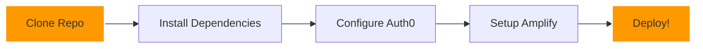

# 🌟 Auth0 + AWS Amplify Integration

<div align="center">

[](https://github.com/yourusername/AUTH0-Amplify-aws)

[](https://github.com/laharikarrotu/AUTH0-Amplify-aws/stargazers)
[](https://github.com/laharikarrotu/AUTH0-Amplify-aws/issues)
[](LICENSE)

---

  

*Supercharge your authentication with Auth0 and AWS Amplify! ✨*

[Get Started](#-quick-start) • [Features](#-features) • [Documentation](#-documentation) • [Support](#-support)

---

</div>

## ⚡ Features

<div align="center">

| 🔑 Authentication | 🚀 Deployment | 🛡️ Security |
|:----------------:|:-------------:|:-----------:|
| Single Sign-On | One-Click Deploy | Role-Based Access |
| Social Login | CI/CD Pipeline | Token Management |
| Custom UI | Auto Scaling | Secure Sessions |

</div>

## 🚀 Quick Start

<div align="center">



</div>

### 🔧 Installation

```bash
# Clone the repository
git clone https://github.com/yourusername/AUTH0-Amplify-aws.git

# Navigate to project
cd AUTH0-Amplify-aws

# Install packages
npm install

# Start development
npm start
```

## 📦 Project Structure

<div align="center">

```
AUTH0-Amplify-aws/
├── 📱 src/
│   ├── 🧩 components/
│   ├── 📄 pages/
│   ├── 🔒 auth/
│   └── ⚙️ config/
├── 🚀 amplify/
├── 🌐 public/
└── 📋 package.json
```

</div>

## ⚙️ Configuration

<div align="center">

| Auth0 Setup | Amplify Setup |
|-------------|---------------|
|  Create App |  Initialize |
| 🔗 Set URLs | 🔧 Configure |
| 🌐 Add Origins | 🚀 Deploy |

</div>

## 🎨 Customization

<div align="center">

| Component | Description |
|-----------|-------------|
| `Login` | Authentication UI |
| `Profile` | User Dashboard |
| `Nav` | Navigation Bar |
| `Routes` | Protected Pages |

</div>

## 📚 Documentation

<div align="center">

[](https://auth0.com/docs)
[](https://docs.amplify.aws)

</div>

## 🤝 Contributing

<div align="center">

| Step | Action |
|------|--------|
| 1️⃣ | Fork repo |
| 2️⃣ | Create branch |
| 3️⃣ | Make changes |
| 4️⃣ | Open PR |

</div>

---

<div align="center">

### Made with 💖 by LahariKarrotu


</div>
