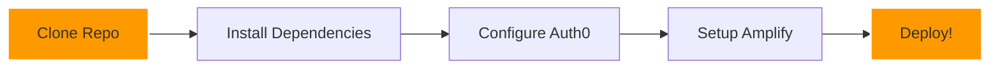

# 🌟 Auth0 + AWS Amplify Integration

<div align="center">


[](https://github.com/laharikarrotu/AUTH0-Amplify-aws)

[](https://github.com/laharikarrotu/AUTH0-Amplify-aws/stargazers)
[](https://github.com/laharikarrotu/AUTH0-Amplify-aws/issues)

---

  


*Supercharge your authentication with Auth0 and AWS Amplify! ✨*

[Get Started](#-quick-start) • [Features](#-features) • [Documentation](#-documentation) • [Support](#-support)


---

</div>

## ⚡ Features

<div align="center">

| 🔑 Authentication | 🚀 Deployment | 🛡️ Security |
|:----------------:|:-------------:|:-----------:|
| Single Sign-On | One-Click Deploy | Role-Based Access |
| Social Login | CI/CD Pipeline | Token Management |
| Custom UI | Auto Scaling | Secure Sessions |


</div>

## 🚀 Quick Start

<div align="center">



</div>

### 🔧 Installation

```bash
# Clone the repository
git clone https://github.com/laharikarrotu/AUTH0-Amplify-aws.git

# Navigate to project
cd AUTH0-Amplify-aws

# Install packages
npm install

# Start development
npm start
```

### 📝 Environment Setup

```bash
# Create .env file
AUTH0_DOMAIN=your-domain.auth0.com
AUTH0_CLIENT_ID=your-client-id
AUTH0_CALLBACK_URL=http://localhost:3000/callback

# Initialize Amplify
amplify init
amplify push
```

## 📦 Project Structure

<div align="center">

```
AUTH0-Amplify-aws/
├── 📱 src/
│   ├── 🧩 App.jsx
│   ├── 📄 main.jsx
│   ├── 🔒 auth/
│   │   └── auth0-config.jsx
│   ├── 🎨 components/
│   │   ├── nav-bar.jsx
│   │   ├── signup.jsx
│   │   ├── logout.jsx
│   │   └── login.jsx
│   └── ⚙️ styles/
├── 🚀 amplify/
│   ├── backend/
│   │   └── auth/
│   └── hosting/
├── 📋 package.json
├── 🔧 vite.config.js
├── 🌐 amplify.yml
└── 📝 index.html
```

</div>

## ⚙️ Configuration

<div align="center">

| Auth0 Setup | Amplify Setup |
|-------------|---------------|
|  Create App |  Initialize |
| 🔗 Set URLs | 🔧 Configure |
| 🌐 Add Origins | 🚀 Deploy |

</div>

### Auth0 Configuration Steps

1. Create a new application in Auth0 Dashboard
2. Set allowed callback URLs:
   ```
   http://localhost:3000/callback
   https://your-production-domain.com/callback
   ```
3. Enable required social connections
4. Note down your Auth0 domain and client ID

### Amplify Configuration Steps

1. Install Amplify CLI:
   ```bash
   npm install -g @aws-amplify/cli
   ```
2. Configure Amplify:
   ```bash
   amplify configure
   ```
3. Initialize your project:
   ```bash
   amplify init
   ```

## 🎨 Customization

<div align="center">

| Component | Description |
|-----------|-------------|
| `Login` | Authentication UI |
| `Profile` | User Dashboard |
| `Nav` | Navigation Bar |
| `Routes` | Protected Pages |

</div>

### Styling Components

```jsx
// src/components/Auth/Login.js
const Login = () => {
  return (
    <div className="auth-wrapper">
      <div className="auth-inner">
        <h2>Welcome Back! 👋</h2>
        {/* Auth0 Login Button */}
      </div>
    </div>
  );
};
```

## 📚 Documentation

<div align="center">

[](https://auth0.com/docs)
[](https://docs.amplify.aws)

</div>

### Key Documentation Links

- [Auth0 React SDK](https://auth0.com/docs/quickstart/spa/react)
- [AWS Amplify Authentication](https://docs.amplify.aws/lib/auth/getting-started/)
- [Custom Authentication Flow](https://docs.amplify.aws/lib/auth/customflow/)
- [Deployment Guide](https://docs.amplify.aws/cli/hosting/)

## 🤝 Contributing

<div align="center">

| Step | Action |
|------|--------|
| 1️⃣ | Fork repo |
| 2️⃣ | Create branch |
| 3️⃣ | Make changes |
| 4️⃣ | Open PR |

</div>

### Contributing Guidelines

1. Fork the repository
2. Create your feature branch:
   ```bash
   git checkout -b feature/AmazingFeature
   ```
3. Commit your changes:
   ```bash
   git commit -m 'Add some AmazingFeature'
   ```
4. Push to the branch:
   ```bash
   git push origin feature/AmazingFeature
   ```
5. Open a Pull Request

## 📈 Activity

<div align="center">

[](https://github.com/laharikarrotu/AUTH0-Amplify-aws)


</div>

## 🐛 Bug Reports

Found a bug? Please open an issue with:
- Expected behavior
- Actual behavior
- Steps to reproduce
- Environment details

## 📄 License

This project is licensed under the MIT License - see the [LICENSE](LICENSE) file for details.

---

<div align="center">

### Made with 💖 by laharikarrotu


</div>
